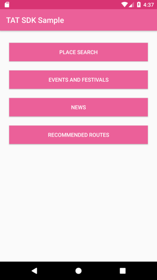

# TAT-SDK-Android-Sample app

Welcome to the TAT-SDK-Android Sample application. This application demostrates how to use the TAT-SDK for Android inside an Android app.

## Prerequisites

You can get **API Key** from [TAT Developer Guide and Console](https://developers.tourismthailand.org/console) website.

## Download TAT-SDK-Android
<<<<<<< HEAD
[  ](https://bintray.com/nostratat/maven/tat-sdk/_latestVersion)
=======
>>>>>>> 04c482a5b03784e38f97dc0fab2e0ac9de906fcd

use Gradle:

```gradle
<<<<<<< HEAD
repositories {
    google()
    jcenter()
    mavenCentral()
=======
// In Project's build.gradle
repositories {
    google()
    jcenter()
>>>>>>> 04c482a5b03784e38f97dc0fab2e0ac9de906fcd
    maven {
        url 'https://dl.bintray.com/nostratat/maven'
    }
}

<<<<<<< HEAD
=======
// In Module's build.gradle
>>>>>>> 04c482a5b03784e38f97dc0fab2e0ac9de906fcd
dependencies {
    implementation 'org.th.tatsdk:tatsdk:0.0.6'
}
```
## How do I use TAT-SDK-Android ?

Setup API Key for initial environment in application like this:

```java
// Create BaseApplication class that extend Application,
// then setup API Key in this class.
@Override
public void onCreate() {
    super.onCreate();
    String apiKey = "[API_KEY]"
    TATSDKEnvironment.setEnvironment(apiKey, this);
```

 * SDK Reference: [TAT-SDK-Android Reference](https://gdev.geotalent.co.th/tatsdk/android/)

## Samples
<<<<<<< HEAD
1. [Place Search](/app/src/main/java/org/tat/sdksample/placesearch/README.md)
2. [Events and Festivals](/app/src/main/java/org/tat/sdksample/event/README.md)
3. [News](/app/src/main/java/org/tat/sdksample/news/README.md)
4. [Recommended Routes](/app/src/main/java/org/tat/sdksample/recommendedroute/README.md)
<!--5. [ChatBot](/app/src/main/java/org/tat/sdksample/chatbot/README.md)-->


=======
1. [Place Search](/placesearch/README.md)
2. [Events and Festivals](#EventsAndFestival)
3. [News](#News)
4. [Recommended Route](#RecRoute)
>>>>>>> 04c482a5b03784e38f97dc0fab2e0ac9de906fcd

## Compatibility

 * Minimum Android SDK requires a minimum API level of 23.
 * Compile and Target Android SDK requires you to compile against API 28 or later.

## Authors

<<<<<<< HEAD
* Power by GLOBETECH Co., Ltd - [GlobeTech Co., Ltd. – CDG](https://www.cdg.co.th/website/about-cdg/affiliates-of-cdg/globetech-co-ltd/)
=======
* Powered by GLOBETECH Co., Ltd - [GlobeTech Co., Ltd. – CDG](https://www.cdg.co.th/website/about-cdg/affiliates-of-cdg/globetech-co-ltd/)
>>>>>>> 04c482a5b03784e38f97dc0fab2e0ac9de906fcd
* Developed by GEOTALENT Co., Ltd - [GEOTALENT | GIS Developer](https://www.geotalent.co.th)

## License

* Copyright © <a href="https://www.tourismthailand.org/home" target="_blank">Tourism Authority of Thailand</a>.

## Acknowledgments

* Glide - https://github.com/bumptech/glide
