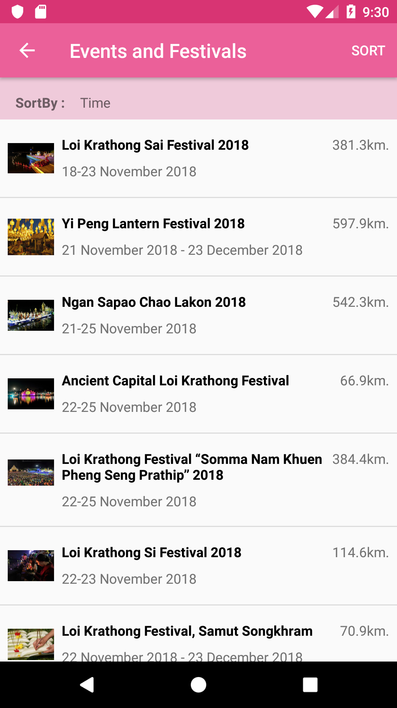
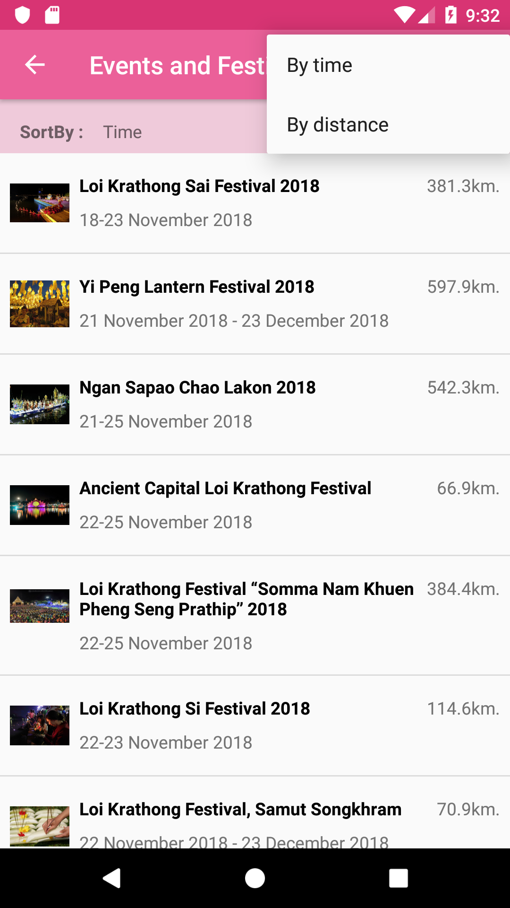
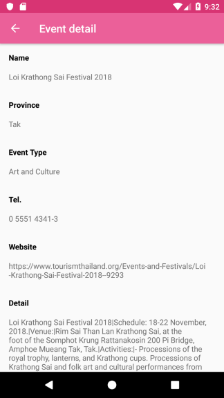

# Find Events and Get Event's detail 
This sample demonstrates how to use `TATEvents` to find the list of events with `TATFindEventsParameter` and how to get the event's detail from `TATGetEventDetailParameter`.

# Find Events
How to use `TATEvents` to find the list of events by `find` method.
## Parameters
 * **language** use `TATLanguage` to set display language. *supported `TATLanguage.ENGLISH` for display in English or `TATLanguage.THAI` for display in Thai.*
 * **geolocation** use `TATGeolocation` set up tha latitude, longitude value when you want to search the events around.
 * **sort** use `TATEventSortBy` to sort the events. *supported: `TATEventSortBy.DISTANCE` for sorted by distance or use `TATEventSortBy.DATE` for sorted by start date of event.*
 
## How to use the sample
 1. Choose sort menu on status bar that show 2 options are By Date or By Distance.
 2. The results are sorted according by sort option you choose.

### Feed Events

### Sort options

# Get Event's detail
How to use `TATEvents` to get the event's detail by `getDetail` method with event id.
## Parameters
 * **eventId** The Event ID from find events result.
 * **language** use `TATLanguage` to set display language. *supported `TATLanguage.ENGLISH` for display in English or `TATLanguage.THAI` for display in Thai.*

## How to use the sample
 1. Choose one of event from result.
 2. Show the result of the selected event.

### Get Event's detail

