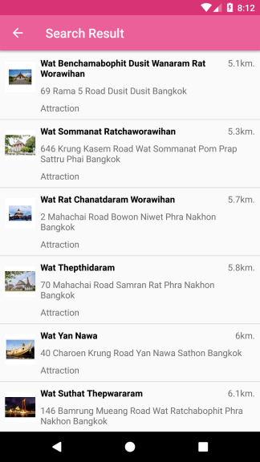

# Place Search and Place Detail 

This sample demonstrates how to use `TATPlacesSearch` to search places from `TATPlacesSearchParameter` and get the detail of places such as: Attraction, Accommodation, Restaurant, Shopping and Other type by search conditions

## Place Search parameters
 * **keyword / setKeyword method** *such as name, latitude and longitude of place or mapcode.*
 * **setCategories method** *use `TATCategory` supported `TATCategory.ATTRACTION`, `TATCategory.ACCOMMODATION`, `TATCategory.RESTAURANT`, `TATCategory.SHOP` and `TATCategory.OTHER`*
 * **latitude and longitude / setLatitude or setLongitude method** value *when you want to search places around you.*
 * **setProvinceName method**
 * **setRadius method** *(Maximum radius is 200 Kilometer. The unit is Kilometer)*
 * **setNumberOfResult method** *(Maximum result is 50 items)*
 * **setLanguage method** *use `TATLanguage.ENGLISH` for English display or `TATLanguage.THAI` for Thai display.*

## How to use the sample
 1. Enter keyword to search.
 2. Choose categories one or more options.
 3. Select `Nearby location` when used the location reference search result.
 4. Click `Search` button to get place result.
 5. When you clicked a result that show the detail of place by category.

### Place Search

### Search Result

## Place Detail parameters
 * **placeID** *from place search result*
 * **language / setLanguage method** *use `TATLanguage.ENGLISH` for English display or `TATLanguage.THAI` for Thai display.*

## How to use the sample
 1. Choose one of place from result.
 2. Show the result of the selected place.

### Place Detail

