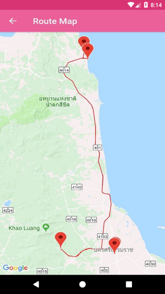

# Recommended Route Search and Recommended Route Detail 

This sample demonstrates how to use `TATGetRoutes` to search routes from `TATGetRoutesParameter` and get the detail of routes such as: number of trips day or trips region by search conditions

## Route Search parameters
 * **numberOfDays / setNumberOfDays method**
 * **latitude and longitude / setLatitude or setLongitude method** value *when you want to search places around you.*
 * **point / setPoint method** *when you want to search places around you by using `TATPoint`.*
 * **region / setRegion method** *when you want to search route in specific region by using `TATRegion`.*
 * **setLanguage method** *use `TATLanguage.ENGLISH` for English display or `TATLanguage.THAI` for Thai display.*

## How to use the sample
 1. Specify number of day(Optional).
 2. Choose Region(Optional).
 3. Select `Nearby location` when used the location reference search result.
 4. Click `Search` button to get place result.
 5. When you clicked a result that show the detail of route.

### Recommended Routes Search

### Recommended Routes Result

## Route Detail parameters
 * **routeId** *from route search result*
 * **language / setLanguage method** *use `TATLanguage.ENGLISH` for English display or `TATLanguage.THAI` for Thai display.*

## How to use the sample
 1. Choose one of route from result.
 2. Show the result of the selected route.
 3. When you click view on map will display route path on map.

### Route Detail

### Route on Map

