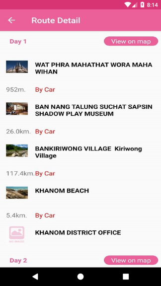

# Find Recommended Routes and Get Route's detail 

This sample demonstrates how to use `TATRecommendedRoutes` to find the recommended routes from `TATFindRoutesParameter` and get the route's detail from `TATGetRouteDetailParameter`.

# Find Recommended Routes
How to use `TATRecommendedRoutes` to find the recommended routes by `find` method.
## Parameters
 * **language** use `TATLanguage` to set display language. *supported `TATLanguage.ENGLISH` for display in English or `TATLanguage.THAI` for display in Thai.*
 * **geolocation / setGeolocation method** use `TATGeolocation` set up tha latitude, longitude value when you want to find the recommended routes which the distance from first place of route is less than 50 kilometers.
 * **region / setRegion method** use `TATRegion` is the Regions of Thailand, *such as: `TATRegion.NORTHERN`, `TATRegion.NORTHEASTERN`, `TATRegion.WESTERN`, `TATRegion.CENTRAL`, `TATRegion.EASTERN` and `TATRegion.SOUTHERN`*.
 * **numberOfDays / setNumberOfDays method** The number of days to filter result.

## How to use the sample
 1. Specify number of day(Optional).
 2. Choose Region(Optional).
 3. Select `Nearby location` when used the location reference search result.
 4. Click `Search` button to get place result.
 5. When you clicked a result that show the detail of route.

### Find Recommended Routes

### Recommended Routes Result

# Get Route's detail
How to use `TATRecommendedRoutes` to get the route's detail by `getDetail` method.
## Parameters
 * **routeId / setRouteId method** The Route ID from find recommended routes result.
 * **language / setLanguage method** use `TATLanguage` to set display language. *supported `TATLanguage.ENGLISH` for display in English or `TATLanguage.THAI` for display in Thai.*
 * **setDay method** Specific the day in the route.

## How to use the sample
 1. Choose one of route from result.
 2. Show the result of the selected route.
 3. When you click view on map will display route path on map.

### Get Route's detail

### Route on Map

